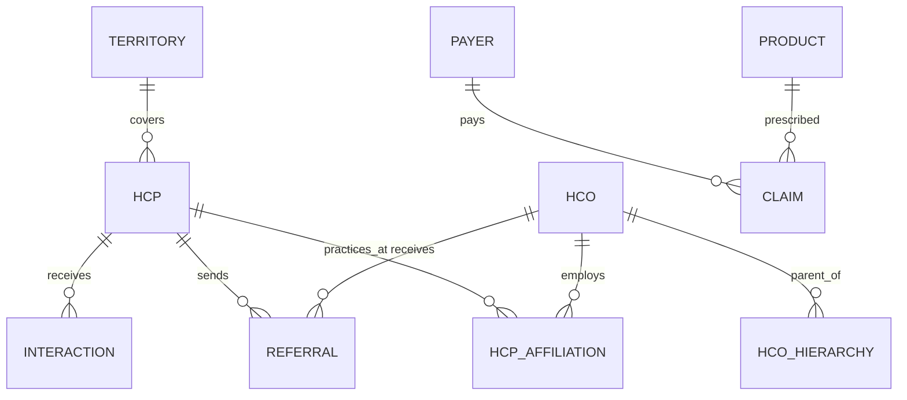

Start with the product vision, not the tables.

Most MDM projects fail because people begin with schemas and matching algorithms. Real MDM begins with a business question.

For a project of this size, I would build the **Healthcare Market Operating System**.

# Phase 0: Define the Product

Imagine this app exists.

A commercial user opens the application and searches:

> "Dr. John Smith"

The application returns:

```text
Who is this physician?

Where does he practice?

Who owns those facilities?

How influential is he?

Who refers patients to him?

Where does he refer patients?

Which payers dominate his patients?

How digitally engaged is he?

Which sales rep owns him?

Has his affiliation changed recently?

Should we target him?
```

Everything in the architecture exists to answer these questions.

# Phase 1: Define the Business Domains

Your first deliverable should not be SQL.

Create a domain inventory.

| Domain      | Description                        |
| ----------- | ---------------------------------- |
| HCP         | Physicians, NPs, PAs               |
| HCO         | Hospitals, Clinics, Health Systems |
| Agency      | Hospice, HHA, SNF                  |
| Payer       | Medicare, Commercial               |
| Territory   | Geographic assignments             |
| Affiliation | Physician ↔ Facility               |
| Referral    | Entity ↔ Entity patient flow       |
| Interaction | Calls, Emails, Events              |
| Product     | Drug portfolio                     |
| Digital     | Website, Email engagement          |

These become your master entities.

# Phase 2: Define Golden Records

For each domain answer:

```text
What is the business definition?

Who owns it?

Which sources contribute?

How is identity resolved?

How are conflicts resolved?

What attributes survive?
```

Example.

## Golden HCP

### Sources

```text
NPPES
Claims
CRM
EMR
Trella
HealthPivot
```

### Business Key

```text
MASTER_HCP_ID
```

### Matching Keys

```text
NPI
UPIN
DEA
Name + Address
Phone
```

### Survivorship

```text
NPI:
NPPES > CRM > Claims

Specialty:
Claims > NPPES

Phone:
CRM > NPPES

Email:
CRM only
```

Output:

```text
MDM_GOLDEN_HCP
```

# Phase 3: Create the Enterprise Canonical Model

This is the backbone.



Spend serious time here.

Changing canonical models later is painful.

# Phase 4: Design the Snowflake Layers

I would use:

```text
RAW
STAGING
CANONICAL
DELTA
MATCH
SURVIVORSHIP
GOLDEN
SERVING
```

Example:

```text
RAW_NPPES_PROVIDER

STG_NPPES_PROVIDER

INTG_HCP_CANONICAL

DELTA_HCP

MATCH_HCP_CANDIDATES

XWALK_HCP

MDM_GOLDEN_HCP

RPT_HCP_360
```

# Phase 5: Implement Identity Resolution

This is the heart.

## Deterministic Matching

```text
Exact NPI

Exact DEA

Exact UPIN
```

## Fuzzy Matching

```text
Name similarity

Address similarity

Phone similarity

Organization similarity
```

Example score:

| Rule       | Weight |
| ---------- | ------ |
| Exact NPI  | 100    |
| Exact Name | 20     |
| DOB        | 30     |
| Address    | 15     |
| Specialty  | 10     |

Threshold:

```text
>=95 Auto Match

80-94 Steward Review

<80 No Match
```

# Phase 6: Crosswalk Repository

Create:

```sql
MDM_HCP_CROSSWALK

MASTER_HCP_ID
SOURCE_SYSTEM
SOURCE_HCP_ID
MATCH_SCORE
MATCH_METHOD
ACTIVE_FLAG
EFFECTIVE_DT
EXPIRATION_DT
```

This table becomes sacred.

Never delete history.

# Phase 7: Build Survivorship Engine

Example.

```sql
CASE
    WHEN CRM_EMAIL IS NOT NULL
         THEN CRM_EMAIL

    WHEN NPPES_EMAIL IS NOT NULL
         THEN NPPES_EMAIL

    ELSE CLAIMS_EMAIL
END
```

Track lineage.

```text
EMAIL_SOURCE = CRM
PHONE_SOURCE = NPPES
SPECIALTY_SOURCE = CLAIMS
```

# Phase 8: Historical MDM

Use SCD Type 2.

Example:

```text
MASTER_HCP_ID = 1001

2025:
Practices at Hospital A

2026:
Practices at Hospital B
```

Both records remain.

Commercial users care about movement.

# Phase 9: Derived Intelligence Layer

This is where the magic appears.

Create scores.

## Influence Score

```text
Referral volume

Facility quality

Network reach

Claims volume

Panel size
```

## Accessibility Score

```text
Ownership

Employment model

System restrictions
```

## Network Centrality

Use graph algorithms.

```text
Degree Centrality

Betweenness

PageRank
```

# Phase 10: Build the Final Product

Expose:

```text
RPT_HCP_360

RPT_HCO_360

RPT_REFERRAL_NETWORK

RPT_NETWORK_SCORECARD

RPT_MARKET_OPPORTUNITIES
```

# Actual Build Order

Week 1

```text
Business domains
Canonical model
Source inventory
```

Week 2

```text
Raw ingestion
Staging layer
```

Week 3

```text
Canonical entities
```

Week 4

```text
Matching engine
```

Week 5

```text
Crosswalk repository
```

Week 6

```text
Survivorship framework
```

Week 7

```text
Golden layer
```

Week 8

```text
Scoring layer
```

Week 9

```text
Serving layer
```

Week 10

```text
API + dashboard
```

The very first artifact I would create tomorrow morning is a single document called:

```text
Healthcare Market Operating System
Enterprise Canonical Data Model v1.0
```

If this document is excellent, the rest of the project becomes implementation. If it is weak, the project collapses.

