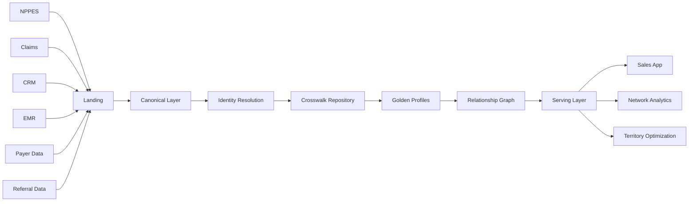

# Project-Helios
If you want a portfolio-defining MDM project, avoid "customer 360" or "provider 360". Everybody does those.

Healthcare has an ugly reality: identities are fragmented, organizations constantly merge, affiliations change, and decisions are made using incomplete data.

The most interesting projects sit exactly at that intersection.

# 1. National Care Network Intelligence Platform

## Problem Statement

Healthcare organizations struggle to identify:

* Which physicians truly influence patient flow.
* Which facilities belong to the same operational ecosystem.
* Which referral relationships are active.
* Which organizations should be targeted for expansion.

Data arrives from:

* NPPES
* Claims vendors
* EMR systems
* CRM
* Call activity
* Hospital affiliations
* Payer contracts
* Referral systems
* Marketing platforms

Every source identifies providers differently.

As a result:

* Same physician exists 15 times.
* Same hospital exists under multiple names.
* Referral leakage cannot be measured.
* Sales teams target the wrong accounts.

## Build

Create an enterprise MDM platform producing:

### Golden Physician Profile

Single physician record containing:

* NPI
* specialties
* affiliations
* referral behavior
* procedure volume
* patient demographics
* digital engagement
* prescribing behavior
* payer mix
* influence score

### Golden Organization Profile

Single HCO record containing:

* hospitals
* health systems
* clinics
* ownership hierarchy
* market presence
* quality scores
* contract information

### Golden Relationship Graph

Connect:

```text
Physician
    |
    | practices_at
    |
Hospital
    |
    | owned_by
    |
Health System
    |
    | contracts_with
    |
Payer
```

## Backend Architecture



## Snowflake Features

* Streams
* Tasks
* Dynamic Tables
* Snowpark
* Cortex Search
* Geospatial
* Search Optimization
* Object tagging
* Row access policies

## Business Users

* Commercial Operations
* Sales
* Market Access
* Network Strategy
* Corporate Development

# 2. End-of-Life Care Ecosystem MDM

This is niche and insanely interesting.

## Problem Statement

Hospice companies want to know:

> Which physicians, hospitals, SNFs and home health agencies influence hospice admissions?

Current systems cannot answer:

* Who referred whom?
* Which agencies compete?
* Which physicians influence discharge decisions?
* Which relationships are deteriorating?

## Golden Entities

### Physician

* referral history
* hospice affinity
* palliative propensity
* mortality panel

### Facility

* discharge volume
* LOS
* quality
* ownership

### Agency

* hospice
* home health
* palliative care

## Relationship Types

```text
Physician -> Refers To -> Hospice

Hospital -> Discharges To -> Home Health

SNF -> Competes With -> SNF

Physician -> Affiliated With -> Hospital

Hospital -> Preferred Network -> Hospice
```

## Output

An app answering:

> "Show all physicians in Phoenix influencing >500 annual hospice admissions but not aligned with our network."

This is literally what companies pay millions for.

# 3. Healthcare Digital Twin MDM

Probably the coolest portfolio project.

## Vision

Build a digital twin of the entire healthcare market.

Every healthcare entity becomes a node.

```text
Physicians
Hospitals
Health Systems
Payers
Patients
Labs
Pharmacies
Employers
Territories
Markets
```

Everything is connected.

## Example Questions

### Corporate Development

> Which acquisition gives maximum market share gain?

### Sales

> Which physicians influence oncology prescribing in Dallas?

### Marketing

> Which digital channels drive prescribing behavior?

### Patient Services

> Which patients are at risk of therapy abandonment?

## Golden Layer

### Provider Golden Record

### Organization Golden Record

### Payer Golden Record

### Territory Golden Record

### Market Golden Record

### Patient Household Golden Record

## Add Temporal MDM

Track:

```text
Dr Smith
2023 -> Hospital A

2024 -> Hospital B

2025 -> Health System C
```

Historical truth is preserved.

## Final App

Interactive graph explorer.

Users can traverse:

```text
Health System
    -> Hospital
        -> Physician
            -> Referral Network
                -> Patient Population
                    -> Payer Mix
```

# 4. Rare Disease Patient Journey MDM

Pharma companies spend billions identifying undiagnosed patients.

## Problem Statement

Patient signals exist across disconnected systems:

* claims
* labs
* genetics
* EMR
* specialty pharmacy
* support programs

No single system can reconstruct the patient journey.

## Goal

Create:

### Golden Patient Profile

Containing:

* demographics
* diagnosis timeline
* symptoms
* medications
* lab results
* provider journey

## Additional Layer

Disease progression engine.

Example:

```text
Patient A

2019
Fatigue

2020
Neurology visits

2021
Genetic test

2022
Confirmed ALS
```

## App

Patient timeline explorer.

Commercial teams can identify:

* undiagnosed patients
* referral bottlenecks
* treatment delays

# 5. Healthcare Market Operating System

This is the one I would personally build.

Imagine Salesforce + IQVIA + Trella + Definitive Healthcare + CRM + Claims all merged.

## Golden Domains

* Physician
* Facility
* Health System
* Agency
* Territory
* Payer
* Product
* Account
* Interaction

## Derived Intelligence

### Accessibility Score

### Influence Score

### Referral Strength

### Competitive Threat Score

### Network Centrality

### Digital Engagement Score

### Affiliation Stability Score

### Expansion Opportunity Score

## Final Product

Users open an account and immediately see:

```text
Dr Jane Doe

Influence Score: 92

Referrals:
1200/year

Primary Affiliations:
Mayo Clinic

Hospice Affinity:
High

Network Reach:
8500 Patients

Payer Mix:
60% Medicare

Digital Engagement:
Medium

Competitor Exposure:
High

Recommended Action:
Immediate field engagement
```

This project can easily become:

* 50+ source tables
* 100+ transformations
* 20+ golden entities
* probabilistic matching
* survivorship framework
* graph analytics
* SCD Type 2 history
* data quality framework
* stewardship workflows
* audit lineage
* API serving layer

That is senior engineer to architect level portfolio material.
